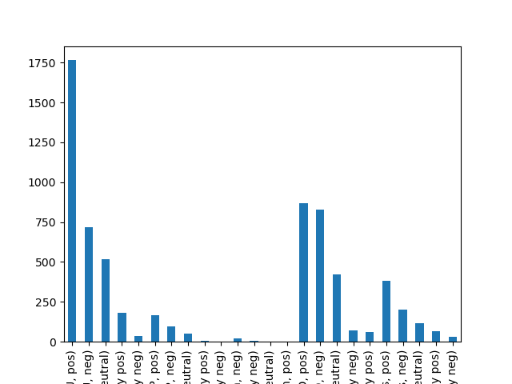
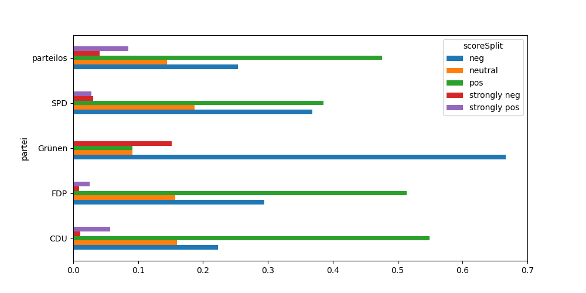
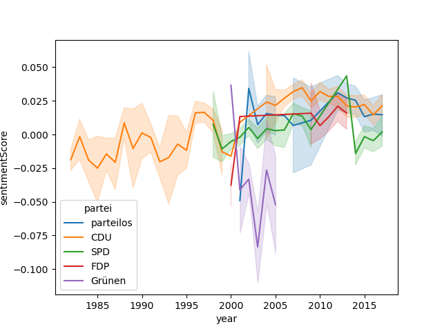
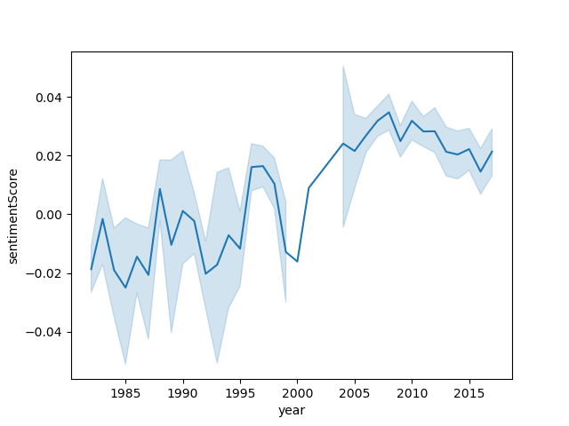
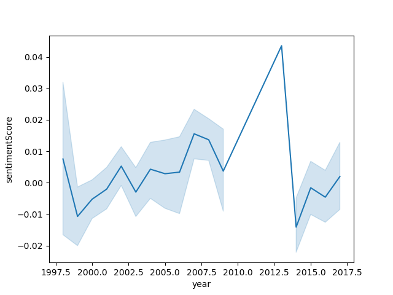
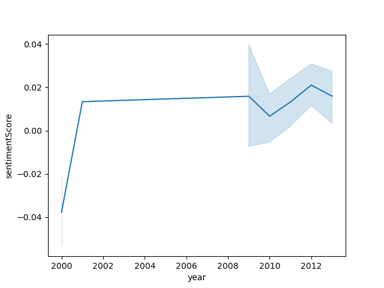
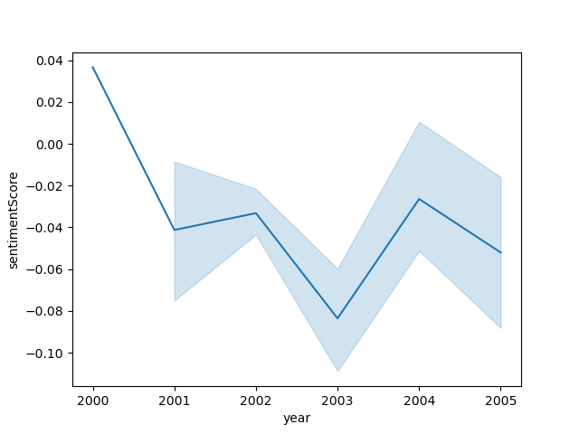

# Final Report
By Riley Hesbacher

## Introduction
I looked at sentiment scores across political parties in Germany. Sentiment is a view or attitude towards something, and this can be measured in speech using sentiment scores that indicate how positive or negative a word or phrase might be. This can show underlying opinions toward a subject or demonstrate change in opinions over time. I wanted to see how this could apply to political speech that is often more curated. 

## Background
I wanted to use sentiment analysis to look at the possible differences in sentiment across German political parties. I was also interested in finding any patterns of how the sentiment scores of these parties might change over time. To understand the data, here is some clarification on parts the German political system that will come into consideration with this project. The German government is led by the chancellor, and it has a parliament that is comprised of politicians of various parties. When a chancellor is chosen, this person is backed by a coalition of parties, so though a person from one party is the chancellor, they work in tandem with leading members of other parties that are in the coalition. There are currently 7 parties represented in the German parliament, but only 4 of these are represented in the data I am working with. Some of these parties, like the Christian Democratic Union and the Social Democratic Party of Germany, which are also the two most popular parties in Germany currently, have been around since Germany was split into East and West, while others, like the Green party, are relatively new. 

## Data Sourcing
I used the Corpus of German Political Speeches.This corpus consists of 6,685 speeches by 71 speakers, spanning a time from 1984 to 2017 and amounting to about 13 million words. These speeches come from speakers who are a part of the German government. The speeches are split into which office the speaker was from: the chancellery, the presidency, the Bundestag or the Ministry of Foreign Affairs. The corpus includes the speech, the speaker, the date and the location where the speech was made.

I also used the German sentiment analyzer SentiWortschatz(SentiWS). The current version of SentiWS contains around 1,650 positive and 1,800 negative words, which sum up to around 16,000 positive and 18,000 negative word forms including their inflections, respectively. It not only contains adjectives and adverbs explicitly expressing a sentiment, but also nouns and verbs implicitly containing one. This analyser is trained on words from newspapers, and its words all have weights from -1 to 1 that are based on how related they are to other positive or negative words. It is a bag of words approach, meaning that each word is considered individually and does not account for negation. 

## Data Cleanup
For data cleaning and value adding,I started by taking the xml files from the corpus and turning them into dataframes for easier use. I combined the files that were split in 4 sections into one main dataframe. I found that some columns had missing values, so I evaluated what was necessary for analysis and dropped unneeded columns with missing values. There were speeches with missing speakers, and I decided to get rid of these because they wouldn't be useful without the speaker information and it was only a relatively small portion. I also had to go back and change the formatting of some dates of speeches because they were in differing formats that affected the analysis later. I then added information for the speaker's political affiliation, gender, and position. I also tokenized the speeches and found the sentiment of each word and of each speech using SentiWS. After cleanup, there are 6619 speeches. There are 71 speakers used in the data who come from  5 parties, including parteilos(partyless). Those parties are: 'parteilos', 'CDU', 'SPD', 'FDP', 'Grünen'. 61.27813869164527 % of the speeches are made by men and 38 72186130835474 % are by women. There are 44 positions represented in the data.

## Analysis
I started by analyzing the differences between the sentiment scores of the different political parties. I split the scores into strongly negative, negative, neutral, positive, and strongly positive.
To start, I looked at the distribution of this split across the parties. 

This was a bit hard to compare across because there is an uneven distribution of speeches per party, so I took a look at the normalized version.

For all of the parties except the Greens(Grünen) positive was most common. The Greens have an unusually high percentage of negative speeches, and they have the highest percentage of strongly negative speeches. I then wanted to make sure that the variation between parties was statistically significant, so I ran tests. I found that the overall variation wasn't huge, but the p-values, indicating the significance of the variation showed that the differences were significant. The CDU and SPD had the most variation in sentiment scores, and the FDP and parteilos were the most similar.

I also looked at the individual words that were most common in strongly positive and negative speeches.

These are the 20 most common words in strongly positive, their weights, and English translation:
- [('freue', 0.2198)] (happy)
- [('Freude', 0.6502)] (joy)
- [('Erfolg', 0.3446)] (success)
- [('danke', None)] (thanks)
- [('liebe', None)] (dear/love)
- [('Engagement', 0.2157)] (engagement)
- [('Mut', 0.6093)] (bravery)
- [('guten', None)] (good)
- [('Zusammenarbeit', 0.0893)] (cooperation)
- [('feiern', 0.494)] (celebrate)
- [('lernen', 0.2492)] (learn)
- [('danken', 0.191)] (to thank)
- [('wichtige', 0.3822)] (important)
- [('miteinander', 0.3697)] (with each other)
- [('Bildung', 0.004)] (education)
- [('Freiheit', 0.004)] (freedom)
- [('freuen', 0.2198)] (to be happy)
- [('Freundschaft', 0.2059)] (friendship)
- [('Tradition', 0.004)] (tradition)
- [('Liebe', 0.0985)] (dear/love)

These are the 20 most common words in strongly negative, their weights, and English translation:
- [('Krieg', -0.5364)] (war)
- [('Gewalt', -0.5363)] (violence)
- [('Frieden', 0.004)] (peace)
- [('Verantwortung', 0.004)] (responsibility)
- [('Freiheit', 0.004)] (freedom)
- [('Leid', -0.5056)] (suffering)
- [('Schuld', -0.9686)] (fault/blame)
- [('Krieges', -0.5364)] (war)
- [('Unrecht', -0.5086)] (injustice)
- [('Angst', -0.514)] (fear)
- [('Kampf', -0.5372)] (fight)
- [('Hass', -0.5014)] (hate)
- [('Tod', -0.0697)] (death)
- [('Trauer', -0.0048)] (grief)
- [('verloren', -0.393)] (to lose)
- [('Gefahr', -1.0)] (danger)
- [('Auseinandersetzung', -0.0603)] (confrontation)
- [('Gedenken', 0.004)] (commemorate)
- [('Sicherheit', 0.004)] (security)
- [('Wahrheit', 0.004)] (truth)

For the most part, the most common words for strongly positive and strongly negative seem like they match their grouping. Some words like 'Frieden'(peace) seem misplaced, but they might be used in a context saying "there's no peace" or something similar. 

Then, I took a look at how the sentiment scores of each party changed over time. These speeches span from 1984-2017, so there have been a lot of political events in those years that may have affected the sentiment of speeches.

This shows the changes of all political parties at once, but it's not very easy to decipher when they're on top of each other. Below the four parties, not including partyless, are separated into each party.

The CDU is one of Germany's oldest political parties. It existed in West Germany before the reunification in 1990. It has also stayed one of Germany's largest parties. This is the only party that has speech data before 1997. We can see that following the reunification, sentiment scores dropped overall. Around 2001, there is a more consistent rise in scores. This rise led up to the election of Angela Merkel, a member of the CDU, as Chancellor in 2005.

The SPD is another prominent party in the German government that was in government prior to reunification. The sentiment seems to fluctuate around somewhat negative, other than the stark jump in sentiment around 2009-2013. During the German federal elections in 2009, the SPD lost 76 seats in parliament, a considerable amount. It's interesting that the sentiment following this event rises. In 2013 , scores drop again. In the 2013 federal election, the SPD gained many seats back. I find it interesting that, similar to the CDU, leading up to a considerable political win, the speeches tended to be more positive.

The FDP doesn't have a very wide range of time, and it stays relatively consistent at around .18 other than the first data point which is much lower. In 2009, when the SPD lost parliamentary seats in the election, the FDP gained. We see that, following this, there is a slight drop in score.

The green party has an extremely small time frame compared to the other parties. This party was only founded in 1993, making it a relatively new party. It starts with a pretty positive point, then decreases and remains in the negatives.

## Reflection/Process
Overall, I definitely learned from this project. I started this project with a lot of ideas on what I could do with this data, but due to lack of time and general mediocre time management, I didn't get to some different types of analyses I had wanted to do. This was more so a good start to other types of sentiment/topic analysis. Because of this project, I have a better idea of what kind of efforts it takes and what kind of projects I would like to do in the future.
I definitely had a hard time focusing how I wanted to do this project. I think, because of this, I was a bit scattered in how I did the project. The data cleaning went well, and adding values, though tedious, was not bad. As I got into analysis, the sentiment analyzer was giving me some issues. I had difficulty finding a good quality German sentiment analyzer, and I ended up using SentiWS after struggling to set up another larger tool. Because of the time constraint, I continued with the sentiment analysis as it was going, but if I had had more time I would have gone in a different direction with this project, focusing more on topics in political speech.